

**Classification of research papers of Computer Science into sub-fields from arXiv archives**

ArXiv is an open access repository of research articles from many fields such as Physics, Mathematics, Computer Science, Statistics, Quantitative Biology, and Finance. 

Our goal is now to classify the research papers from Computer Science specifically into four groups/sub-fields: Artificial Intelligence (AI), Cryptography and Security (CT), Computation & Languages (CL), Databases (DB). The papers have been selected from these four subfields and annotators are unaware of which fields paper belong to. 

Let us look at the steps we have taken in collecting the data, processing it, and building the model.

1. **Scraping:** 

Using the arXiv API we scraped to the latest paper of Computer Science field by the order of the submitted date. Here we obtain a total of 200 latest papers belonging to the four sub-fields listed above, and we mainly stored two attributes, title and summary of the paper. We obtained a CSV file with dimensions 200 X 2. It is to be noted that there is a limit of 100 words for each summary. 

Now let us look into how labeling has been done on the above data and what steps have been taken.

1. **Labelling:**

Here the two annotators are given with the task of labelling 200 latest research papers of Computer Science into 4 subfields Artificial Intelligence (AI), Cryptography and Security (CT), Computation & Languages (CL), Databases (DB). The annotators are unaware of which subfield research papers belong to. Then they are given with the excel sheet to label. Below is the format for the attributes.

Here we can see that the first and second column are the labels given by annotators after going through title and summary of the paper.

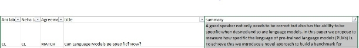

Here is the confusion matrix obtained from the labels given by the annotators where the horizontal values specify the annotator Anirudh and vertical values are given by Neha.

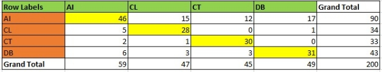

Diagonal elements show the number of cases where both the annotators agreed on a research paper belonging to a sub-field. And all other element show a mismatch of opinion where one annotator feels one research paper belong to one sub-field while the other feels it belongs to another field.

We calculated the inter-annotator agreement value using this above matrix.

Inter-annotator agreement value= (Agree-ChanceAgree)/(1-ChanceAgree)

Chance agree= ChanceAgree (AI) + ChanceAgree (CT)+ ChanceAgree (CL)+ ChanceAgree (DB)

Agree = (Sum of diagonal values)/ (Total number of records) = 0.675

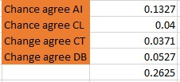

ChanceAgree(AI)=ProbAni(AI) × ProbNeha(AI) = 0.1327

ChanceAgree(CL)=ProbAni(CL) × ProbNeha(CL) = 0.0400

ChanceAgree(CT)=ProbAni(CT) × ProbNeha(CT) = 0.0371

ChanceAgree(DB)=ProbAni(DB) × ProbNeha(DB) = 0.0527

Total ChanceAgree= 0.2625

Inter-annotator agreement value= (0.675-0.2625)/(1- 0.2625) = 0.5593

Note that research papers cannot be confined to a single sub-field in Computer Science, so we can observe disagreements in the labelling done by the annotators.

After discussing thoroughly between each other, we have commonly agreed on a set of labels for each of the 200 records and from now on we use this set of labels while we train, test and validate the model.

1. **Text Processing**

After scraping we have obtained a CSV file which title and summary on which we now have to apply some text processing. We standardize the text by removing punctuations and numbers, single characters and multiple spaces as seen in the below code.

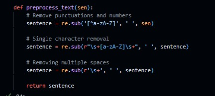

After this, we concatenate title and summary into one string, which makes it important to analyze the title and summary for the complete picture of data.

For the labels we mapped the values 0 to Artificial Intelligence (AI), 1 to Databases (DB), 2 to Cryptography and Security (CT), and 3 to Computation & Languages (CL) and maintain a separate list of these labels for corresponding list of 200 strings obtained above.

**Tokenization :** 

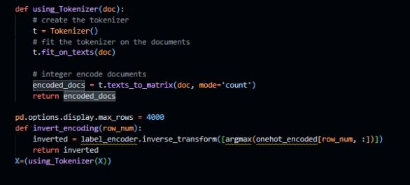

Now we take the input string and apply tokenization using keras and then get its integer value using LabelEncoder(), and then get onehot encoding of the word by referring to the label encoded values by using onehotEncoder().

We split the data into training and testing by taken four sets X\_train, X\_test, y\_train, y\_test.

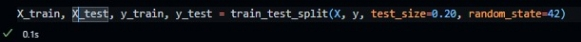

We use 20% data as test data in X\_test and y\_test and 80% as training data in X\_train and y\_train.

Here X\_train and X\_test are input text strings and y\_train and y\_test are corresponding labels for those input text strings.

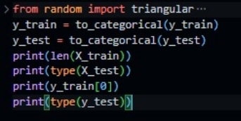

Here the labels are converted into binary class matrix which can be then used for the model.

1. Model

The model we used is identical to the model used for classification on reuters dataset given in the course textbook. For the model we used 3 dense layers where the 1st layer has 64 neurons with the activation function as relu. The 2nd layer is similar to the 1st layer and has 64 neurons with the activation function as relu. The 3rd layer has 4 nodes which correspond to the 4 classes in our data and has softmax activation function.

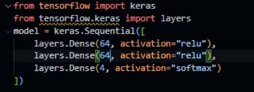

We used the optimizer rmsprop and we used categorical\_crossentropy as loss function.

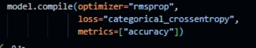

We split 20 of the remaining 160 X\_train records as validation records and also did the same for Y\_train as x\_val and y\_val respectively.

Now we fit the model by having a batch size of 10 and 20 epochs.

` `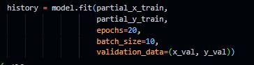

1. Result/Output

Note that we would have a higher validation accuracy and reliability, where we have more data inputs. Below is the output for each epoch where we can see training and validation accuracy for each epoch and training loss and validation loss. We can observe validation accuracy of 70% and validation of 0.93.

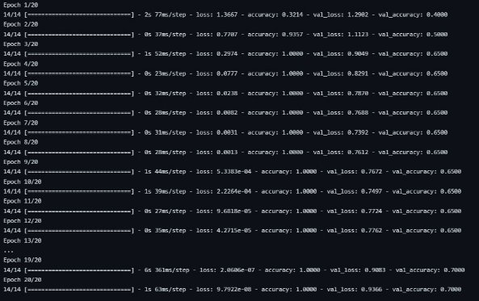

Below is the graph for training accuracy and validation accuracy with increasing epochs on x axis and accuracy on y. axis.

`                 `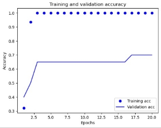

Below is the graph for training loss and validation loss with increasing epochs on x axis and loss on y. axis.

`                 `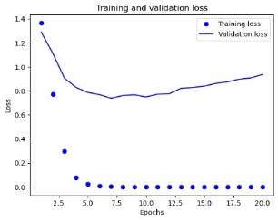

When tested with data which is new to the model, we can observe an accuracy of 80% and this is shown in the google colab notebook linked with the assignement.

Hence, this is how we collect the data, label it, process it and build a model around this data and obtain the results in a workflow.
